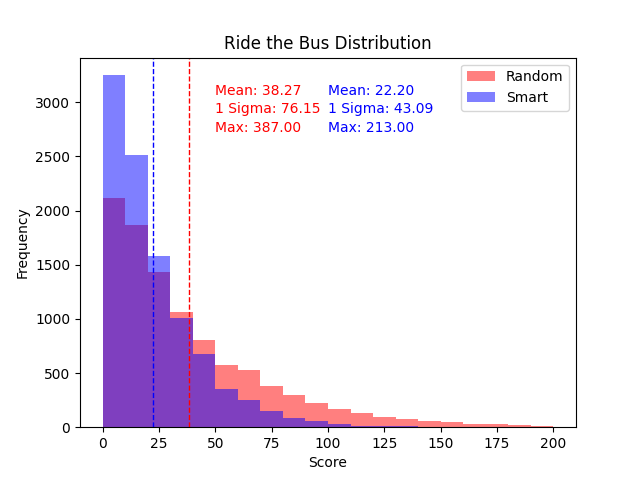

Writing some code to compare the outcomes in card games between purely random strategies, and strategies using information that a perfect human player could have.

*Red-Black*
---------------
Dealer flips one card at a time for a player to guess 'Red' or 'Black' then removes that card from the deck. A good human player would keep track of how many Red/Black cards they have seen, and knows that the deck contains more of the color they have seen less of.

*Ride the Bus*
----------------
A four step card game, a player is given cards where they must guess correctly or start over. In order they must predict whether the card is: 
    1) Red or Black
    2) Higher or Lower (or equal to) card 1
    3) Inside or outside the bounds of card 1 and card 2 (e.g. c1 = 4h c2 = 10s 7d would be inside, Jd would be outside)
    4) The suit of the final card

